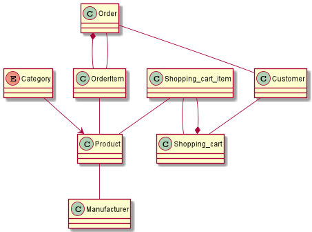

# POS 4BHIF IShop 2019/20

## What it is all about

This project is a database application for a Webshop called IShop.

## How to start

- clone
 - build 
    - prompt> mvn clean package
    
## IShop Model
 

## Important DeveloperInformation

Um die Daten für Produkte und Orders zu bekommen, keine Liste in Customer und Manufacturer haben, sondern im Repository eine Methode, um alle Orders vom Customer zu bekommen:
- OrderRepo.findByCustomerId
- OrderRepo.findByArticleId
- ArticleRepo.findByManufacturerId

## Whom to contact

- __Dennis SIMA__     <SIM18354@spengergasse.at>
- **Max Donninger**  <DON18126@spengergasse.at>